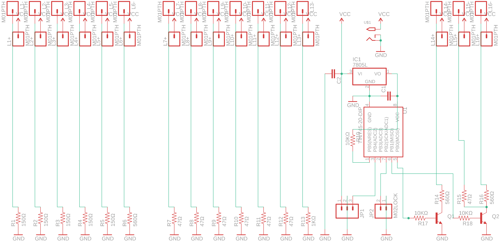
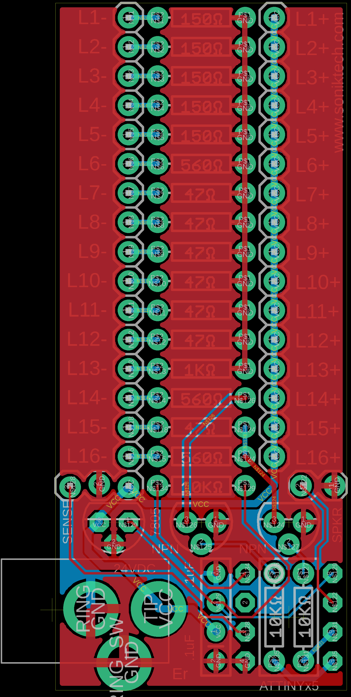
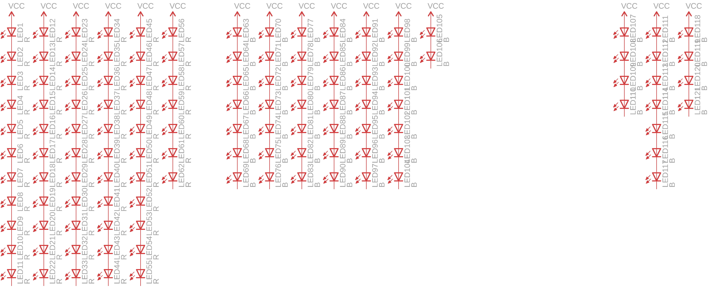
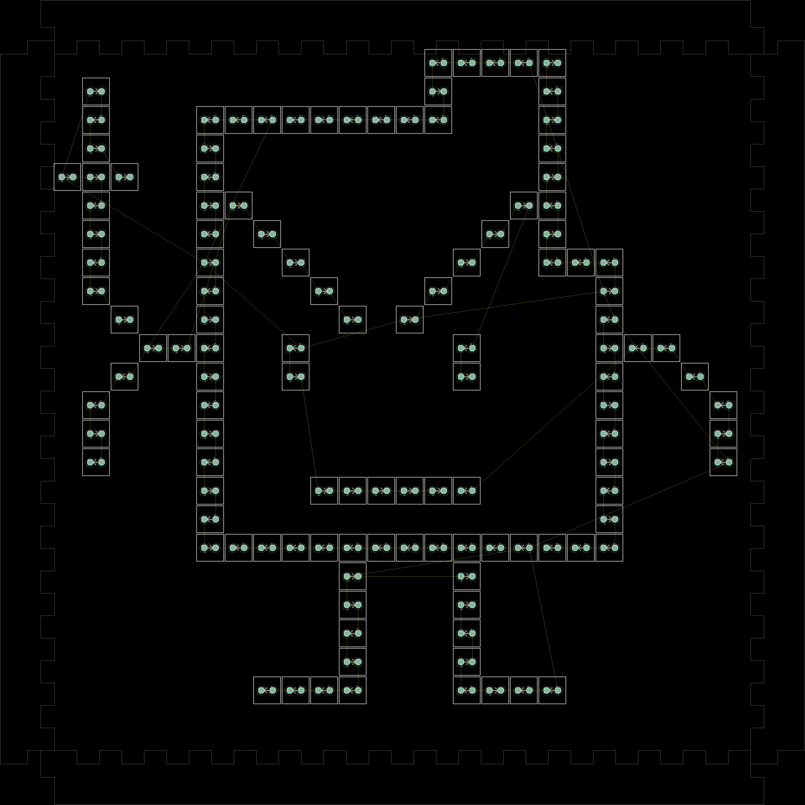

# athf-er
Blinking LED welcome sign

I made this sign to welcome people to my house warming party. The lights alternate between his hand being down and flyting the bird.

I was never comfortable in Inkscape, so I made the acrylic laser cutout design using Eagle. This helped me get exact sizing for the cutouts and an easily mesaureable layout, perfect for pixel stuff.

